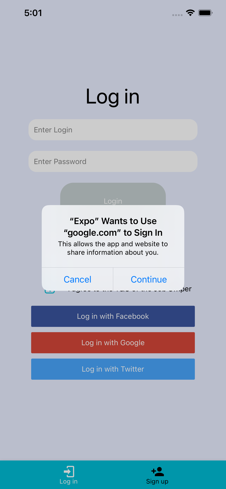
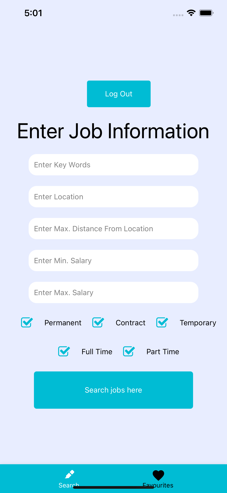

# JobSwiper

## Functionality

Job searching application with a Tinder-like swiping feature for selecting
jobs previously specified by the user. Swiping left discards the job from
the deck of cards whilst swiping right moved the job advertisement into a
separate tab where the user can apply for it later. The user logs in
through a third-party app using the secure OAuth2 feature. Subsequently,
selecting the job title (or simply inserting the keywords) and entering
the job specifications into the appropriate field. The job advertisements
are fetched from the Reed.co.uk API and are presented to the user in the
deck of cards form. Once the user selects appropriate job advertisements,
they can come back and apply for them later.

<b>YouTube link: </b> https://youtu.be/ptx-PKpxj4Q

## Presentation

<table style="width:100%">
  <tr>
    <td></td>
    <td></td>
    <td></td>
  </tr>
  <tr>
    <td></td>
    <td></td>
    <td></td>
  </tr>
  <tr>
  </tr>
</table>
